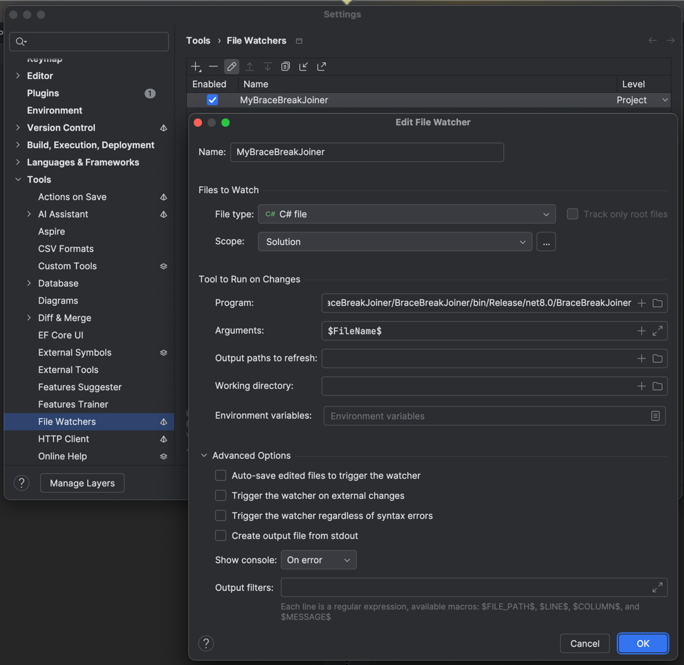

1. Build this solution;
2. Open a solution where you want this to work;
3. Go Settings | Tools | File Watchers;
4. Add a File watcher as per below screenshot:

5. Save the file watcher;
6. Now when Rider detects change of a file that matches criteria(a .cs file belonging to a solution), Rider will invoke the built executable that replaces any "}\s*break;" with "} break;"